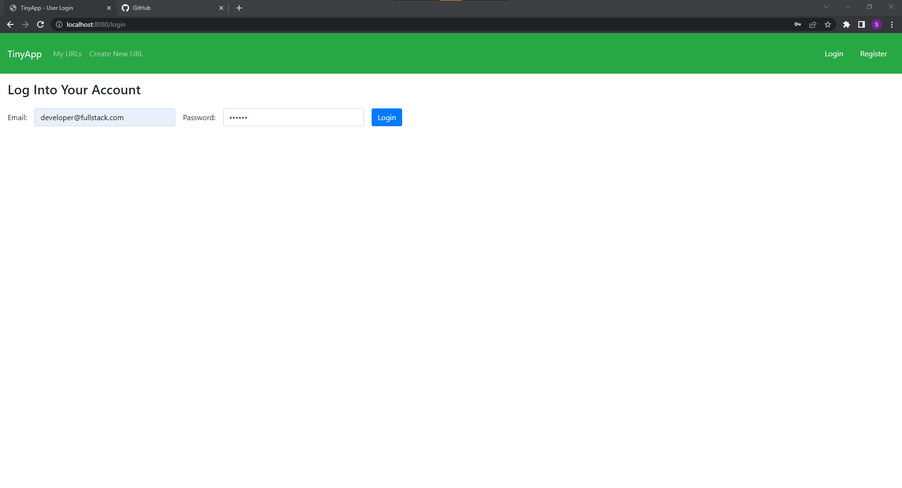
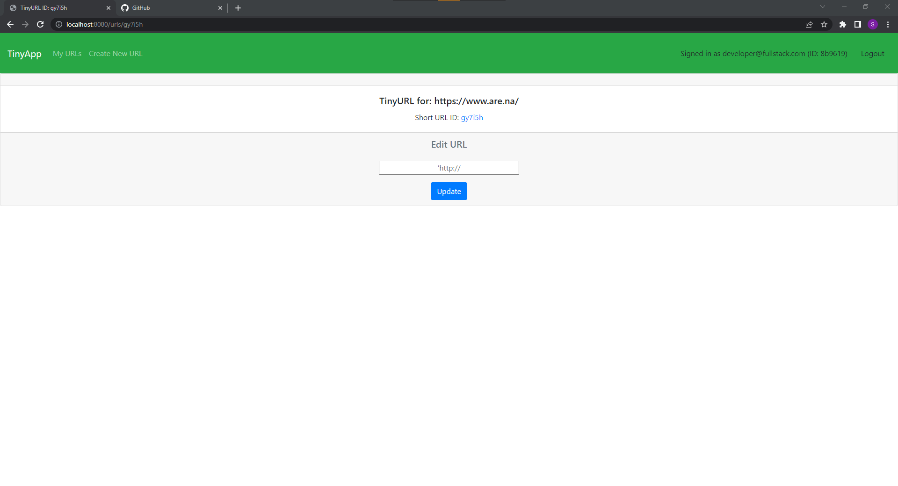
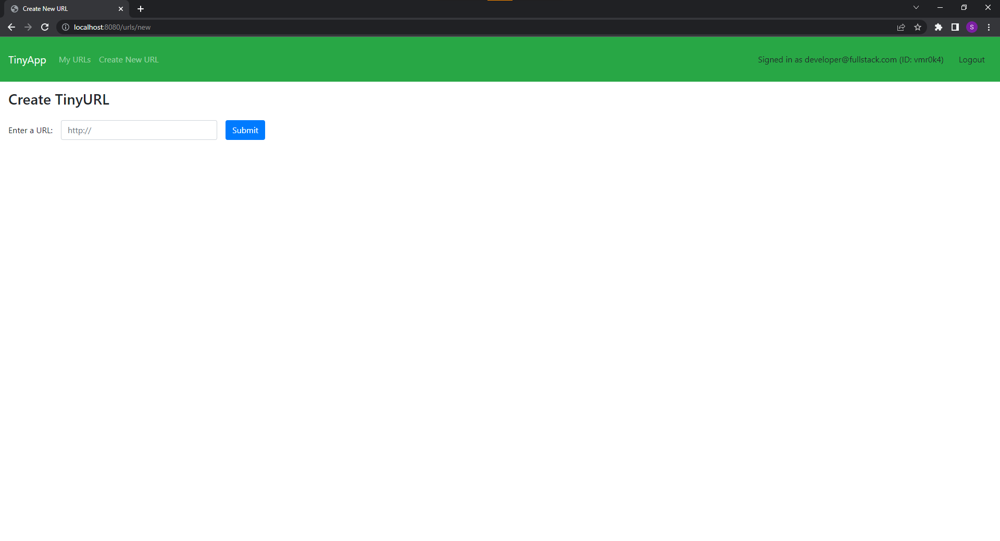
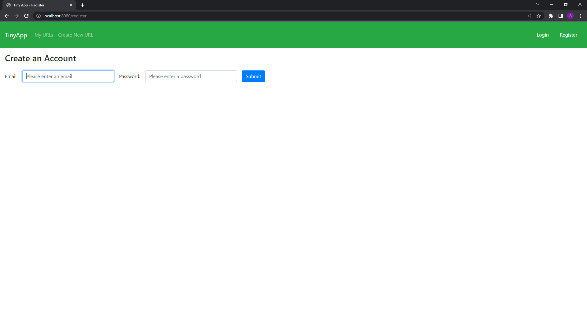

# TinyApp Project

TinyApp is a full stack web application built with Node and Express that allows users to shorten long URLs (à la bit.ly).

## Final Product

## Dependencies

- Node.js
- Express
- EJS
- bcryptjs
- cookie-session

## Getting Started

- Install all dependencies (using the `npm install` command).
- Run the development web server using the `node express_server.js` command.
- Click "Register" link on the top right corner of the page to start an account
- Click "Create New URL" to create a new shortened URL, all URLs will be archived to index/home page
- URLs can be edited by clicking the "Edit" button and removed from the database by clicking the "Delete" button
- Only URLs created by the user can be viewed, edited and deleted
- All session cookies are wiped upon clicking the "Logout" button; however the URLs created by the user will stay in memory until the server is reset.
